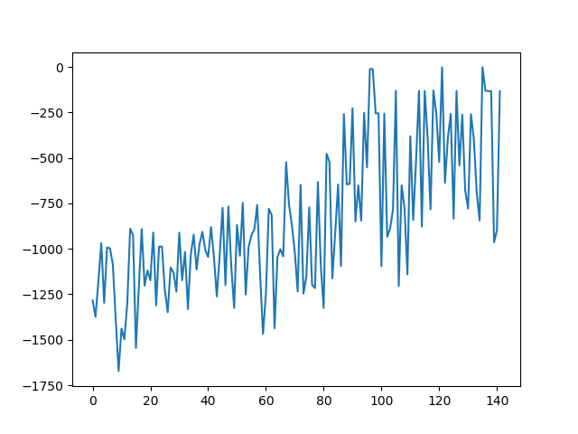

# Pendulum_PPO
Solving OpenAI Pendulum-v0 using [Proximal Policy Optimization Algorithms](https://arxiv.org/pdf/1707.06347.pdf)

## Quickstarted
Run this command to use the pretrained model to play the game
```
>python pendulum.py play
```
Or run this command to train the model
```
>python pendulum.py anything-(not-play)
```
## Notes
The model in `pendulum.py` was able to solved `Pendulum-v0` after 120 episodes

You're free to edit the model hyperparameters and some constansts to make it better
## Contributions
Special thanks to [Morvan Zhou](https://github.com/MorvanZhou) for the explanation of the PPO 
